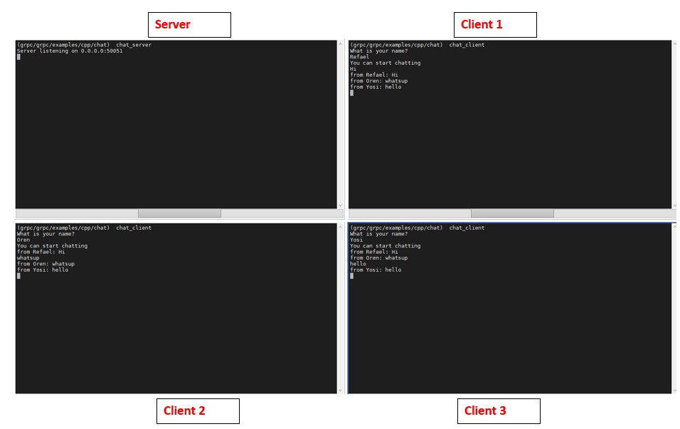

# grpcCppChat

This c++ project demonstrate simple chat app using gRPC

Note: tested on Ubuntu 20.04 LTS

## Main files
### chat.proto
Defines the protocol. 

One bidirectional streaming service - SendMsg.

One message - Message, for the sender name and the text of the message.

### chat_server.cc
The server implementation.

It implements the SendMsg service.

This service store all streams in a vector.

It read meassegs from the clients using read stream, and write the messasges to all clients by looping over all write streams which stored in the vector.

### chat_client.cc
The client implementation.

It using the SendMsg service from the stub in order to write messages to the server (which distribute the message to all clients), and to read the stream that coming from the server.

## How to use it
In your grpc folder go to grpc/grpc/examples.

Put the chat.proto in protos folder

Put the chat folder in cpp folder

### Run it
Go to /grpc/examples/cpp:

To run the server type: chat_server

To run the client type: chat_client

### Build the project

Go to grpc/examples/cpp/chat:

To compile the chat.proto:

type: make chat.grpc.pb.cc chat.pb.cc

To compile the code:

type: make

## Screenshot of the chat

